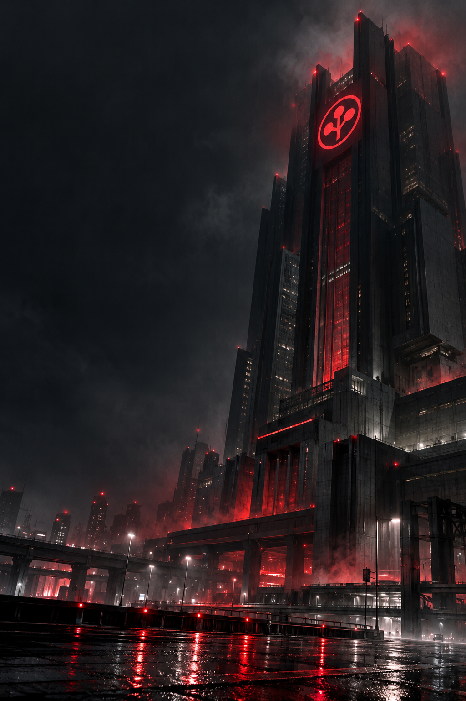

<pre>
ARASAKA SYSTEMS DIVISION
PERSONNEL RECORD // YT4AZAVETA
STATUS: ACTIVE
CLEARANCE: OPERATIONAL
</pre>

### Yt4aZaveta

**Infrastructure. Automation. AI-assisted systems repair.**

I design, harden, and repair technical systems.

Infrastructure, networking, developer tooling, encrypted configuration,
cloud services, backups, monitoring, and autonomous workflows.

I use AI to interrogate failures, accelerate implementation,
and return unstable systems to controlled operation.

**Build. Harden. Automate. Repair.**

<pre>
SYSTEMS    macOS • Linux • OpenWrt • Cloud
OPERATIONS Infrastructure • Networking • Reliability
TOOLS      Terminals • MCP • Codex • Automation
SECURITY   Encrypted configuration • Backups • Access control
METHOD     Diagnose → Control → Deploy → Verify
</pre>

### SELECTED SYSTEMS

- [zed-sops](https://github.com/Yt4aZaveta/zed-sops)  
  Secure SOPS configuration handling for Zed.  
  Plaintext exposure controlled. Encryption preserved.

- [podkop-awg-failover](https://github.com/Yt4aZaveta/podkop-awg-failover)  
  Automated AmneziaWG failover for OpenWrt and Podkop.  
  Connectivity verified at the traffic layer.

---

<pre>
ARASAKA INTERNAL DIRECTIVE:
If it fails, identify the failure.
If it is fragile, harden it.
If it is manual, automate it.
If it is complex, give it to AI — then verify everything.
</pre>

<!-- Profile repository: Yt4aZaveta/Yt4aZaveta -->
